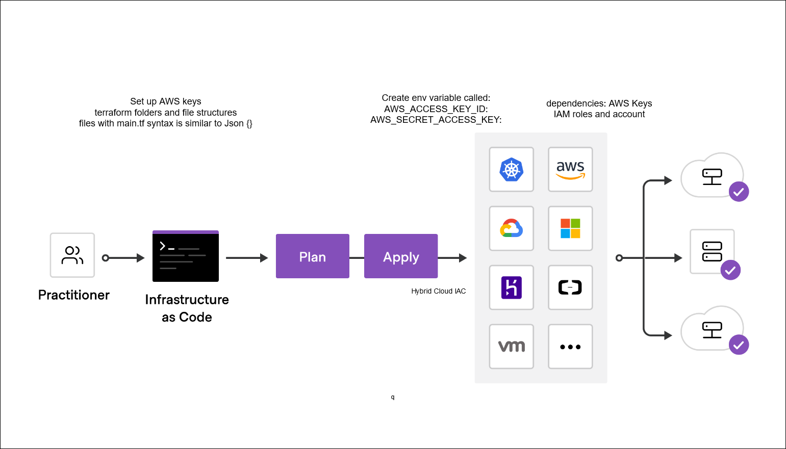

# Terraform
## Introduction
- What is Terraform?

> "Terraform is an infrastructure as code (IaC) tool that allows you to build, change, and version infrastructure safely and efficiently." - [terraform](https://www.terraform.io/intro/index.html)



## Install terraform via [chocolatey](https://chocolatey.org/)
- Install chocolatey;  in powershell:
```powershell
Set-ExecutionPolicy Bypass -Scope Process -Force; [System.Net.ServicePointManager]::SecurityProtocol = [System.Net.ServicePointManager]::SecurityProtocol -bor 3072; iex ((New-Object System.Net.WebClient).DownloadString('https://community.chocolatey.org/install.ps1'))
```  
- `choco install terraform` in terminal

---

##  Create aws env variables
Edit system environment variables > Environment Variables > New.

Add the following: `AWS_ACCESS_KEY_ID` and `AWS_SECRET_ACCESS_KEY` with their respective values.

> Alternatively, [this](https://docs.aws.amazon.com/sdk-for-php/v3/developer-guide/guide_credentials_environment.html); *i.e.,* `SET  AWS_ACCESS_KEY_ID=**********`

---

## Create [main.tf](main.tf)
```js
provider "aws" { # A provider block is used to specify a provider configuration
	region = "eu-west-1"
}
```

Then we will run `terraform init` (or in VSCode click btn at bottom in status bar).

```js
resource "aws_instance" "app_instance" {
	ami = "ami-038d7b856fe7557b3" 
	instance_type = "t2.micro"
	associate_public_ip_address = true
	tags = {
	  "Name" = "eng89_aman_terraform"
	}
}
```
Run `terraform plan`. Then `terraform apply`; type yes.

> Remark: To delete the instance, run `terraform destroy`.

---

## Add ssh keypair to main.tf
You can either include an existing keypair by
```js
key_name = "eng89_aman_qwerty"
```

or making a new one, just use aws to create a new keypair.

---


---

---
### Main.tf
```js
provider "aws" { # A provider block is used to specify a provider configuration
	region = var.REGION
}

resource "aws_instance" "app_instance" {
	ami = var.AMI 
	instance_type = "t2.micro"
	associate_public_ip_address = true

    subnet_id = aws_subnet.eng89_aman_tf_net_public.id 
    vpc_security_group_ids = [aws_security_group.eng89_aman_tf_sg_public.id]
	key_name = var.AWS_KEY_NAME

	tags = {
	  "Name" = var.NAME_OF_INSTANCE
	}
}
```
### vpc.tf
```js
resource "aws_vpc" "eng89_aman_tf_vpc" {
    cidr_block = "${var.SPLICED_CIDR_BLOCK}.0.0/16"
    instance_tenancy = "default"  
    tags = {
        "Name" = var.NAME_OF_VPC
    }
}

resource "aws_subnet" "eng89_aman_tf_net_public" {
    vpc_id = aws_vpc.eng89_aman_tf_vpc.id
    cidr_block = "${var.SPLICED_CIDR_BLOCK}.1.0/24"
    map_public_ip_on_launch = true
    availability_zone = var.SUBREGION  
    tags = {
        "Name" = var.NAME_OF_SUBNET_PUBLIC
    }
}
```

### network.tf
```js

resource "aws_internet_gateway" "eng89_aman_tf_igw" {
    vpc_id = "${aws_vpc.eng89_aman_tf_vpc.id}"
    tags = {
        "Name" = var.NAME_OF_IGW
    }
}

resource "aws_route_table" "eng89_aman_tf_rtb" {
    vpc_id = aws_vpc.eng89_aman_tf_vpc.id
    route {
        cidr_block = "0.0.0.0/0"
        gateway_id = aws_internet_gateway.eng89_aman_tf_igw.id
    }
    tags = {
        "Name" = var.NAME_OF_RTB
    }
}

resource "aws_route_table_association" "eng89_aman_tf_rtb_assoc_public" {
    subnet_id = aws_subnet.eng89_aman_tf_net_public.id
    route_table_id = aws_route_table.eng89_aman_tf_rtb.id
}

resource "aws_security_group" "eng89_aman_tf_sg_public" {
    name = var.NAME_OF_SG_PUBLIC
    description = "A useful description."
    vpc_id = aws_vpc.eng89_aman_tf_vpc.id

    egress { # All traffic
        from_port = 0
        to_port = 0
        protocol = -1
        cidr_blocks = ["0.0.0.0/0"]
    }

    ingress { 
        from_port = 22
        to_port = 22
        protocol = "tcp"
        cidr_blocks = ["0.0.0.0/0"]
    }

    ingress { # for nginx
        from_port = 80
        to_port = 80
        protocol = "tcp"
        cidr_blocks = ["0.0.0.0/0"]
    }
    tags = {
        "Name" = var.NAME_OF_SG_PUBLIC
    }
}

```
### variable.tf
```js
variable "AWS_KEY_NAME" { default = "eng89_aman_161803" }
variable "REGION" { default = "eu-west-1" }
variable "SUBREGION" { default = "eu-west-1a" }
variable "AMI" { default = "ami-038d7b856fe7557b3" }
variable "SPLICED_CIDR_BLOCK" { default = "10.207" }
variable "MY_IP" { default = "0.0.0.0" } # NOT USED, BUT POC

# Names
variable "NAME_OF_INSTANCE" { default = "eng89_aman_tf" }
variable "NAME_OF_VPC" { default = "eng89_aman_tf_vpc" }
variable "NAME_OF_IGW" { default = "eng89_aman_tf_igw" }
variable "NAME_OF_RTB" { default = "eng89_aman_tf_rtb" }
variable "NAME_OF_SG_PUBLIC" { default = "eng89_aman_tf_sg_public" }
variable "NAME_OF_SUBNET_PUBLIC" { default = "eng89_aman_tf_net_public" }
```
